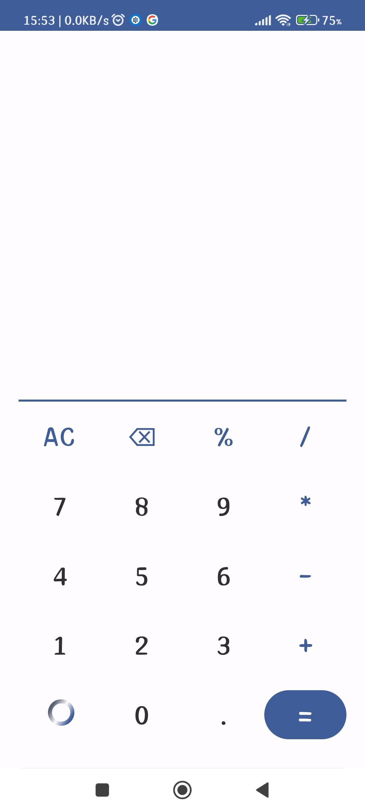
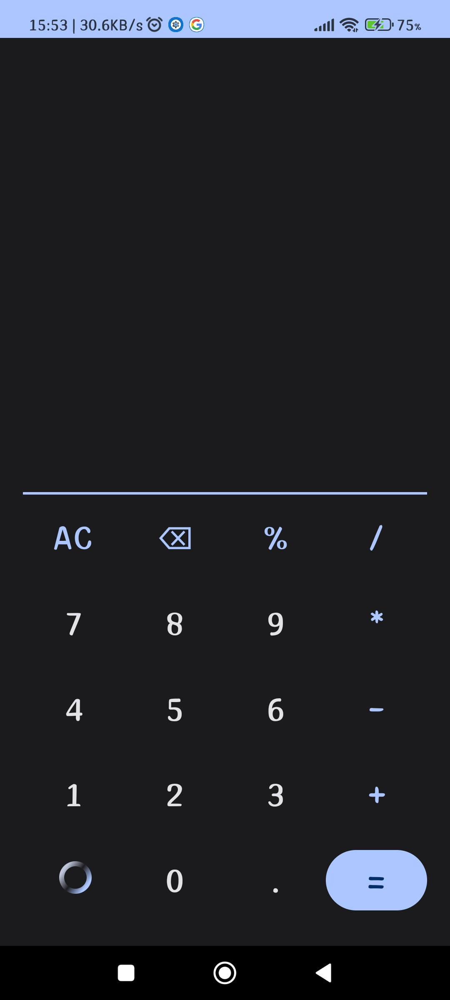

# Calculator

### Description

This application is a simple calculator that allows you to perform basic operations such as addition, subtraction, multiplication and division quickly and easily, ideal for students, professionals or anyone who needs to perform basic mathematical calculations.

### Characteristics

- Simple and easy to use interface.
- Support for basic mathematical operations with up to 10 decimals.
- Animation that changes the color of some buttons.

### How to use

1. Enter the numbers you want to calculate.
2. Select the operation you want to perform.
3. Press the = button to get the result.

### Requirements

Android 7.0 or higher.

### Screenshots

### Used technology
+ Android Studio
+ Jetpack Compose
+ Material Design

I hope you find it useful.